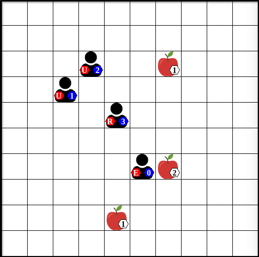
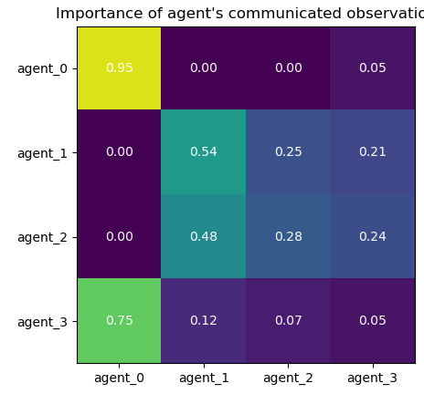

# GAPPO-SSD

This is the codebase for "Efficient Foraging Behaviour Through Reinforcement Learning with Graph-Based Communication". 
A short video demo of the behavior of trained GAPPO agents can be found [here](https://youtu.be/PjarLSBFKMk).
GAPPO is implemented using the RLlib Reinforcement Learning library and PyTorch Geometric a library used to train Graph Neural Networks (GNNs) for a wide range of applications. 
This codebase contains the implementation of GAPPO our variant of the Level-Based Foraging environment.

## Introduction
In the paper of this codebase, we investigate the impact of communication on cooperation among agents in multi-agent reinforcement learning social dilemmas, which are situations where each individual in the population receives a higher reward for defecting rather than cooperating, but all individuals of the population benefit more if everyone cooperates rather than if everyone defects. We particularly focus on a temporally and spatially extended social dilemma that models animal foraging behaviour using principles from the Optimal Foraging Theory. We propose a method to analyse communication that combines a graph-based communication mechanism with deep reinforcement learning methods. Additionally, we examine several facets of communication, including the effects of the type of communication and the communication range.


## Dependencies
GAPPO is implemented using the RLlib and PyTorch Geometric python libraries. The required dependencies can be installed with Pip:

``` python -m pip install -r requirements.txt ```

It is recommended to use a virtual environment such as [Anaconda](https://www.anaconda.com/) or [venv](https://docs.python.org/3/library/venv.html) manager to avoid conflicts with already existing installations of the dependencies.

## Training

### Configuration Files
Training runs are configrered using JSON configuration files. These JSON configuration files allow the user to alter various aspects without modifying code.
An experiment configuration JSON file contains the following adjustable settings:
* `experiment_name`: Name of the experiment - The name of the experiment is used to group runs of the same experiment together in the Tensorboard visualisation toolkit which allows the analysis of various statistics of the runs.
* `n_epsisodes`: The total number of episodes - Allows the user to set the number of episodes each experiment run will take.
* `env`: Environment settings - These settings are used to configure the used environment. In the case of the LBF environment we can adjust the following environment settings:
  * `grid_size`: Grid size - The size of the generated square grid world. 
  * `n_agents`: Amount of agents - The number of agents in the environment. As mentioned earlier agents' spawn positions are random. 
  * `food`: Food - The amount of food that will be spawned in the environment. In contrast to the original implementation of the LBF environment, we allow the user to specify how much of each specific food type needs to be generated. We also allow the user to define how much energy a forager receives from each type of food. 
  * `max_steps`: Maximum steps - Because we allow the food to re-spawn when consumed experiments can theoretically go on forever. For training, however, we cap the episodes to a certain number of steps that can be defined by the user. 
  * `food_respawn_interval`: Food re-spawn interval - The number of steps for food to re-spawn in the environment. We provide two ways of creating food scarcity in the environment. Users can either allow only a few food items to spawn in the environment or make food items take a longer time to re-spawn after being consumed. 
  * `sight`: The sight or observation range of the agents. Each agent can see `sight` cells in each direction.
  * `energy_penalty`: Energy Penalty - The amount of energy consumed by agents in each timestep while looking for food. 
  * `wasted_loading_penalty`: Wasted Loading Penalty - The amount of energy wasted by agents in when they fail to pick up a food item using the 'load' action.
  * `grid_observations`: Grid/Triplet Observation - The LBF environment provides two forms of observations. We allow the user to use any of the two by setting the $grid\_observation$ variable to true or false.
* `communication_topology`: Communication type - The communication topology used in the experiment. We currently support three types of topologies: full communication, range-based communication, and KNN-based communication. We compare these three topologies in later experiments. 
* `communication_args`: Additional communication arguments - For certain communication topologies additional arguments can be provided. In the case of range-based communication for example one can define the communication range of the agents.

The configuration files used for the presented experiments can be found in the [Configs directory](configs).

### Training using configuration file
Once a training configuration file has been created the `train.py` file can be used to train agents. This file expects the following command line arguments:
* `--algo`: The algorithm used to train the agents, currently supports `GAPPO` and `IPPO`
* `--config`: The configuration file that will be used to train the agents, needs to be a path to the configuration file
* `--seed`: Seed for reproducibility
* `--debug` (Optional): Only runs a single training iteration instead of training for `n_episodes`, can be used to debug algorithms or environments

Using these arguments one can train GAPPO agents in the following way:

``` python train.py --algo GAPPO --config ./configs/range/range_2.json --seed 1 ``` 

IPPO agents can be trained using:

``` python train.py --algo IPPO --config ./configs/range/range_2.json --seed 1 ``` 

This will automatically start training the agents using the available resources on the system.

## Evaluation
### Tensorboard
During or after the training of the agents it is possible to analyse various statistics related to the training using the Tensorboard visualisation framework.

``` tensorboard --logdir ./exp_results --port 6006 ```

By visiting the [Tensorboard Dashboard](http://localhost:6006/) various statistics such as the average reward, average episode length, etc. can be analysed.

### Visualize
Additionally, we provide a way to visualise the behaviour of the trained agents using the `visualize.py` file. 
We provide a visualisation of the environment and GAPPO's learned attention weights which represent the importance each agent assigns to other agents during communication. We display the positions of the agents in the grid world along with their IDs in the environment visualisation, and we display the locations of the food items in the grid world along with their levels. Additionally, we also show the last action taken by each agent: (U)p, (D)own, (L)eft, (R)ight, (E)at or do nothing (/).

<p align="center">
  
</p>

We visualise the attention weights using a correlation matrix where each row and column represent an agent. 
Each row `i` represents the importance agent `i` assigned to all other agents, represented by the columns when coming up with its action in this timestep. 
Cell A<sub>1,2</sub> of the correlation matrix for example represents the importance of agent 2's local observation to agent 1 during this timestep. 
By analysing both the last action taken by each agent and their weight attention matrix we can gain additional insights into the learned communication strategy.

<p align="center">
  
</p>

In order to visualize trained agents the following command line arguments need to be provided:
* `--experiment_state`: The `experiment_state.json` file of the training trial that need to be visualized. The `experiment_state.json` files are automatically generated by RLlib and can be found in the [experiment results directory](exp_results) in the directory of the corresponding trial.
* `--seed`: Seed for reproducibility

Using these arguments trained agents can be visualized in the following manner:

``` python visualize.py --experiment_state ./exp_results/range/GAPPO_2/experiment_state-2023-05-29_09-16-35.json --seed 1 ``` 

Advancing to the next step can be done by pressing the `Enter` key in the command line.


